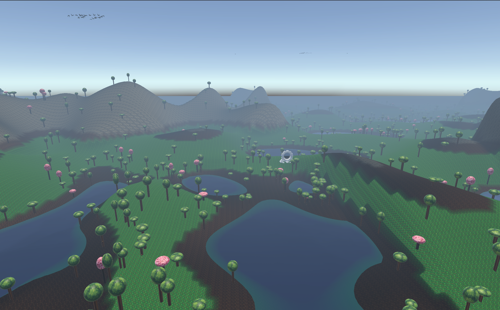
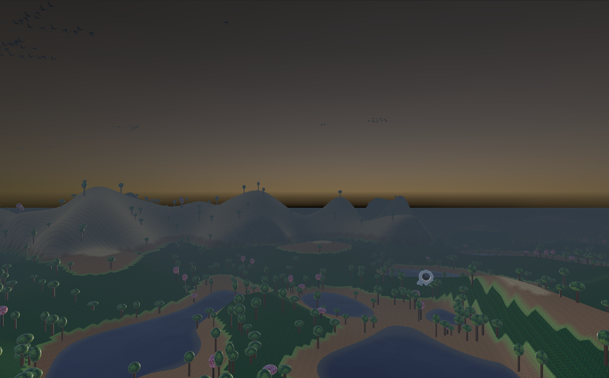
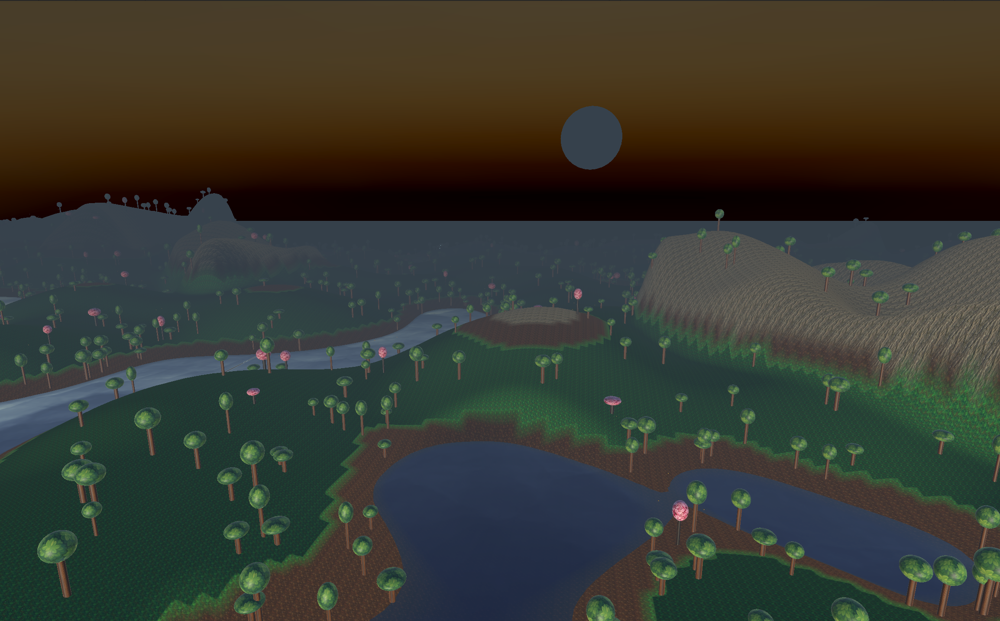

# AI Procedural Terrain Generation & Artificial Ecosystem Simulation

  

**GitHub Repository:** [Enrikkk/AI-Terrain-Generation](https://github.com/Enrikkk/AI-Terrain-Generation)

## Overview

This project is a continuously evolving Unity simulation that combines procedural generation, physics-based interactions, and artificial life into a dynamic, living ecosystem. Instead of a static map, the environment features a Newtonian day/night cycle, atmospheric weather, highly procedural vegetation, and autonomous entities that navigate the terrain via flow fields and mathematical oscillations.

This project was built iteratively to explore advanced topics in AI for Game Development.

---

## Project Evolution & Iterations

### [Iteration 1: Setting the Foundation](./README_ITERATION1.md)

The first iteration laid the groundwork for the core simulation.

* **Procedural Environments:** Integrated dynamic fog driven by Perlin Noise that shifts into pitch black during nighttime.
* **Flora & Fauna Initialization:** Established the base structure for procedural trees, specifically implementing rare Cherry Blossom variations (10% spawn chance) alongside the initial logic for buzzing bees around the canopies, controlled via Custom Triple Sine mathematical oscillation.
* **Runtime Regeneration:** Allowed the user to regenerate a completely new seeded map on demand.

  
   
  <i>Ground-level view of the procedural forest, with cherry blossoms scattered among the regular trees.</i>

### [Iteration 2: The Physics Framework](./README_ITERATION2.md)

The second iteration transformed the static skybox into a physically accurate universe.

* **Newtonian Heavenly Bodies:** The Sun and the Moon were converted to physical Rigidbodies. Instead of basic rotation scripting, they orbit the terrain using Newton's Laws of Universal Gravitation, balancing centripetal force and tangential velocity.
* **Dynamic Lighting Shifts:** Directional lights attached to the orbiting bodies were programmed to aggressively track the map center and shift color temperature to naturally simulate day (warm) and night (cold).
* **Biome Logic & LODs:** Implemented probabilistic tree spawning based on elevation heights (valleys vs peaks) and hooked the trees into Unity's LOD groups for vast performance improvements.

  <video src="https://github.com/Enrikkk/AI-Terrain-Generation/releases/download/readme-media/day_night_cycle.webm" controls width="100%"></video>
   
  <i>Initial scene state — the Sun sits above the terrain and the Moon below it. From here Newton's laws of universal gravitation and Kepler's Third Law take over and the 20-minute orbital cycle begins.</i>

<table>
  <tr>
    <td width="33%"></td>
    <td width="33%"></td>
    <td width="33%"></td>
  </tr>
  <tr>
    <td align="center"><i>Sun descending — sky gradient shifts indigo → amber, fog thickens.</i></td>
    <td align="center"><i>Sunset — directional lights warm, terrain catches the last light.</i></td>
    <td align="center"><i>Moon rising — color temperature has flipped cold and ambient drops.</i></td>
  </tr>
</table>

### [Iteration 3: Breathing Life into the Map](./README_ITERATION3.md)

The third iteration focused completely on creating a vibrant, moving ecosystem instead of just adding more raw terrain features.

* **Dynamic Pollinators:** Greatly refined the bees around the Cherry Blossom trees.
* **Organic Flight Patterns:** Instead of just simple sine wave oscillation, Perlin Noise was layered into the bees' velocity vectors. This combination allowed the bees to wander naturally and unpredictably through the 3D space of the tree canopy.
* **Generative Art Generation:** Assets and textures for the Sun, Moon, trees, and specifically the bees were AI-generated through Google Gemini's image models to fit a cohesive aesthetic perfectly.

  <video src="https://github.com/Enrikkk/AI-Terrain-Generation/releases/download/readme-media/bees.webm" controls width="100%"></video>
   
  <i>Bees wandering around a cherry blossom canopy via triple-sine oscillation with Perlin-noise-modulated velocity.</i>

### [Iteration 4: Flow Fields, Flocking & Shaders](./README_ITERATION4.md)

The fourth iteration heavily expanded the map's complexities, adding water shaders and a massive flocking algorithm system.

* **Aesthetic Water & Textures:** Solved underlying logic bugs in the splat map application to accurately blend rock, dirt, and grass textures according to terrain height. A new water layer was added utilizing a gorgeous Unity Asset Store shader, while forcing the underlying basin terrain to exclusively utilize the "dirt" texture.
* **Grid Systems & Flow Fields:** A robust, invisible 100x100 Grid System was programmed to drape directly over the map. Every cell inside the grid calculates a specific directional vector represented physically via arrows.
* **Dynamic Bird Flocks:** Flocking bird prefabs (varying from 1 to 15 birds per flock) were introduced to act as "Vehicles". Their individual animators were forcibly de-synchronized for organic wing-flapping. They accurately read the arrow vector stored deeply in their local Grid cell, steering smoothly and gracefully utilizing mass and maxForce values toward its heading.
* **Interactive Winds:** The underlying grid vectors can be universally shifted via Keyboard inputs:
  * `P`: Shuffles the universal flow field using scaled **Perlin Noise** to ensure birds take massive, sweeping, unified paths over the map.
  * `G`: Shuffles the universal flow field randomly via a **Gaussian Distribution**.

  <video src="https://github.com/Enrikkk/AI-Terrain-Generation/releases/download/readme-media/flow_field.webm" controls width="100%"></video>
   
  <i>Bird flocks steering through the grid's flow field — press <code>H</code> to toggle the arrow visualization, <code>P</code>/<code>R</code> to reshuffle the field with Perlin or Gaussian noise.</i>

### [Iteration 5: Player Controller and Cave Systems](./README_ITERATION5.md)

The fifth iteration made the simulation fully playable and introduced procedural underground caves.

* **First-Person Player Controller:** Full walk/sprint/jump physics with acceleration and friction, flight mode (`F` key), and mouse-look with pitch/yaw clamping.
* **3D Cave Generation:** A 100×100×40 cellular automata grid (5 smoothing passes) produces organic cave geometry converted to a smooth triangle mesh via the Marching Cubes algorithm.
* **Marching Cubes:** 256-configuration TriTable lookup, vertex welding for watertight meshes, and triplanar UV mapping for seamless rock texturing.

  <video src="https://github.com/Enrikkk/AI-Terrain-Generation/releases/download/readme-media/movement.webm" controls width="100%"></video>
   
  <i>First-person player controller — walk, sprint, jump, and <code>F</code> flight mode for free traversal.</i>

  <video src="https://github.com/Enrikkk/AI-Terrain-Generation/releases/download/readme-media/cave_system.webm" controls width="100%"></video>
   
  <i>Exterior fly-by of the generated cave system — the Marching Cubes mesh emerging out of the cellular-automata voxel grid, with triplanar rock UVs already applied.</i>

### [Iteration 6: Portal System & Cave-Surface Integration (Final)](./README_ITERATION6.md)

The sixth and final iteration connected the underground cave to the surface world and made the cave fully playable.

* **Bidirectional Portal System:** Procedurally paired portals spawn at runtime — one on the terrain surface, one on the cave floor. Smart destination logic uses `Physics.Raycast` for safe cave landings and `terrain.SampleHeight` for surface returns.
* **Cave Interior Collision:** Fixed one-sided `MeshCollider` by reversing Marching Cubes triangle winding order, flipping normals inward so cave walls and floors are solid from inside.
* **Cave-Surface Integration:** Replaced the broken `SetHoles` approach with a portal spawner that scans the cellular automata grid for valid floor cells and pairs them with the surface portal at runtime.

  <video src="https://github.com/Enrikkk/AI-Terrain-Generation/releases/download/readme-media/portals.webm" controls width="100%"></video>
   
  <i>Walking into the surface portal, raycasting onto the cave floor, exploring, then teleporting back via <code>terrain.SampleHeight</code>.</i>

---

## Project Status

This project is **complete**. Six fully functional iterations were delivered across the semester, demonstrating the following AI and game development techniques: procedural terrain generation (Perlin Noise, multi-biome splat mapping), Newtonian orbital physics, artificial life (triple sine bee movement, Perlin-modulated velocity), flow field navigation with bird flocks, a first-person player controller, procedural cave generation (3D cellular automata + Marching Cubes), and a bidirectional portal system.
